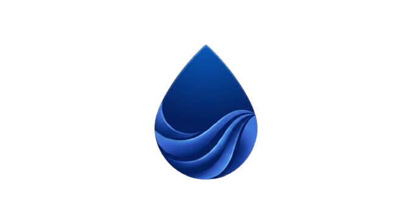

<div align="center">
  
  <h1>velvetdrop.</h1>
  <p><strong>Premium, Lightning-Fast, Peer-to-Peer File Sharing in Your Browser.</strong></p>
</div>

<br/>

## 💎 What is VelvetDrop?

**VelvetDrop** is a modern, luxury-themed evolution of local file sharing. It allows users to transfer files of **any size** instantly between laptops, phones, and tablets across any operating system (iOS, Android, Windows, macOS, Linux) — directly from the browser, with **zero installation** and **zero data stored on external servers**.

Inspired by Apple's AirDrop but designed to be universally accessible, VelvetDrop guarantees privacy by establishing direct browser-to-browser connections. 

---

## 🚀 Why This Project? (The Problem We Solve)

Transferring a 5GB video from an iPhone to a Windows PC, or an Android phone to a Mac, shouldn't require sending data to the cloud.
- **AirDrop is a walled garden:** It only works between Apple devices.
- **Cloud Drives (Google Drive, Dropbox) are slow & inefficient:** You must upload 5GB to a server, then wait for the other device to download 5GB. This wastes bandwidth and time.
- **Messaging Apps compress quality:** WhatsApp and Telegram severely compress images and videos.
- **Legacy Tools (like the original Snapdrop) rely on IP Matching:** If two devices are on a restrictive corporate network, proxy, or VPN, they often appear under different IP addresses or get grouped with strangers.

### The VelvetDrop Solution
VelvetDrop acts as a secure, cross-platform bridge. 
1. Open the app on both devices. 
2. A **Unique Room Code** is generated.
3. Share the link, devices appear on radar, and files transfer **directly between them** at maximum network speeds.

---

## 🛠️ The Technology Explained (How it works under the hood)

VelvetDrop is an architectural masterclass in modern web technologies. Instead of using bulky frameworks (like React or Angular), the entire application is written in heavily optimized **Vanilla HTML, CSS, and JavaScript**.

Here are the three core technologies that make it possible:

### 1. Peer-to-Peer (P2P) Architecture
In traditional file sharing, you upload a file to a central server, and your friend downloads it from that server. In a **P2P network**, the structural middleman is removed. Data flows precisely from **Device A to Device B**. This means a 10GB file transfer uses exactly 0 bytes of our server bandwidth. Your files never touch a database.

### 2. WebRTC (Web Real-Time Communication)
WebRTC is the engine inside modern browsers that allows for direct P2P connections. 
- When you drop a file onto a peer in VelvetDrop, WebRTC opens a secure data channel directly between your phone and your computer.
- It encrypts the payload end-to-end and negotiates the fastest possible physical route over your local Wi-Fi router (bypassing the internet entirety if both devices are on the same network).

### 3. WebSockets (The Signaling Server)
If WebRTC is the engine, **WebSockets** are the matchmakers. 
- For WebRTC to establish a connection, Device A needs to know where Device B is, and what its capabilities are. 
- We built a lightweight **Node.js WebSocket Server**. When devices connect to the same Room Code, our WebSocket server acts as an operator, handing a digital "handshake" between the devices over a persistent, low-latency socket. 
- Once the handshake is complete, the server steps back, and WebRTC takes over the heavy lifting.

---

## ✨ Features that Make it Premium

1. **Room-Based Discovery Engine:** Abandoned flawed IP-based matching in favor of guaranteed, shareable `6-digit Room Codes`. Ensures absolute accuracy in matchmaking even behind proxies or VPNs.
2. **Auto-ZIP Bundling:** Select 50 photos on your phone? VelvetDrop uses client-side algorithms (`JSZip`) to automatically bundle them into a single `VelvetDrop-Archive.zip` on the receiver's end after a smart 1.5-second debounce. 
3. **Progressive Web App (PWA):** Install VelvetDrop directly to your iOS or Android home screen. It behaves identically to a native app complete with splash screens and maskable icons.
4. **Dramatic Luxury Design System:** A meticulously crafted brutalist-glass UI featuring deep `Obsidian & Electric Blue` tokens, oversized watermark typography, and sub-millisecond hardware-accelerated CSS animations.

---

## 💻 Getting Started (Local Development)

The project is split into a static `client` (Frontend) and a `server` (WebSocket Backend). It is fully containerized.

### Prerequisites
- Docker & Docker Compose

### Running the App
1. Clone the repository.
2. Run the application via Docker:
```bash
docker compose up -d --build
```
3. Open your browser to `http://localhost:8080`.
4. Open a second tab to the given room link to simulate a second device.

---

## 🛡️ License & Acknowledgements
VelvetDrop is a heavily re-architected fork inspired by the brilliant original groundwork laid by [Snapdrop](https://github.com/RobinLinus/snapdrop) (GNU GPL v3). This version shifts the paradigm towards manual room isolation, multi-file bundling, and premium aesthetics.
